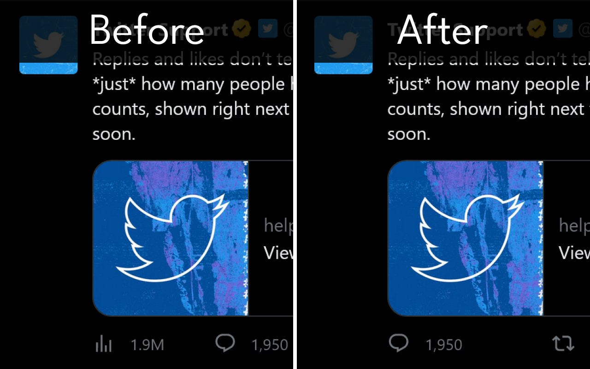

# Hide View Count


[Read in English](README.md)

Twitterのインプレッション数を非表示にして、承認欲求モンスターが生まれてしまうのを防ぐ拡張機能です。インプレッション数の表示を一瞬たりとも許しません！

「インプレッション数を**見たくない**」という人のための拡張機能です。「インプレッション数を**見せたくない**」という用途には利用できません。

- Chrome版：[https://chrome.google.com/webstore/detail/hide-view-count/mmefeobjcchickbjelledfhagoddcklp](https://chrome.google.com/webstore/detail/hide-view-count/mmefeobjcchickbjelledfhagoddcklp)
- Firefox版：[https://addons.mozilla.org/firefox/addon/hide-view-count/](https://addons.mozilla.org/firefox/addon/hide-view-count/)



## できること

- 自分や他人のツイートのインプレッション数を自分のブラウザー上で非表示にする

## できないこと

- 自分のツイートのインプレッション数を他人から見えないようにする
- Web版のTwitter公式クライアント以外のクライアントで利用する

## 対応ブラウザー

- Google Chrome：対応
- Mozilla Firefox：対応
- Microsoft Edge：対応
- Opera：正式に対応はしていないものの、動作するとのユーザー報告あり

## 開発

### 環境構築

```powershell
npm install
```

### ビルド

```powershell
npm build
```

※Manifest v2（Firefox用）とManifest v3（Chrome用）の両方のファイルが、それぞれ次の場所に生成されます。

- Manifest v2：``web-ext-artifacts/manifest_v2/hide_view_count-<VERSION>.zip``
- Manifest v3：``web-ext-artifacts/manifest_v3/hide_view_count-<VERSION>.zip``

### Manifestファイルについて

v2とv3のManifestファイルはそれぞれ、``manifest/v2.json``と``manifest/v3.json``です。

ビルド時にこれらのファイルをコピーして``manifest.json``を生成します。v2とv3を同時にビルドしますが、v2のビルド段階ではv2、v3のビルド段階ではv3のManifestファイルをコピーします。

### バージョン番号について

通常のセマンティックバージョニングに準拠しています。バージョン番号を更新する際は、``npm version``コマンドを使用します。

また、Manifestファイル内に記載されている拡張機能のバージョン番号は、``package.json``に記載されているバージョン番号で上書きされます。そのため、バージョン番号を更新する際に、Manifestファイル内のバージョン番号を編集する必要はありません。
